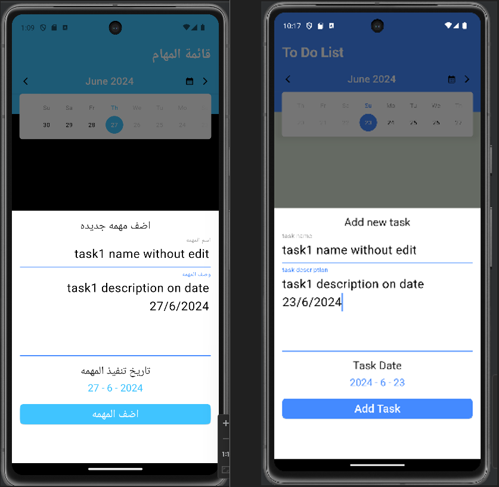
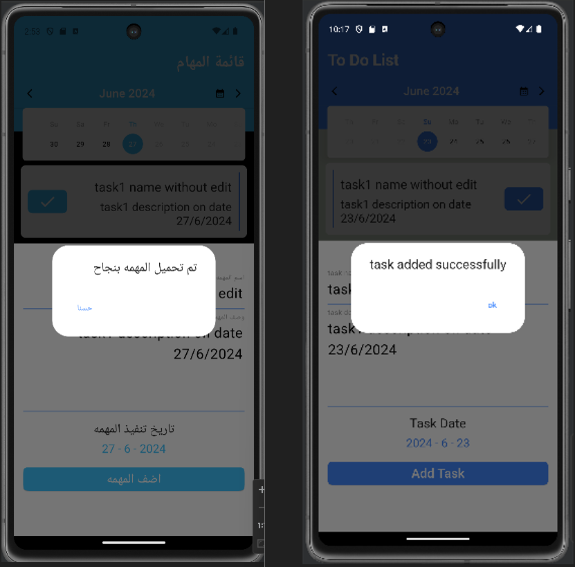
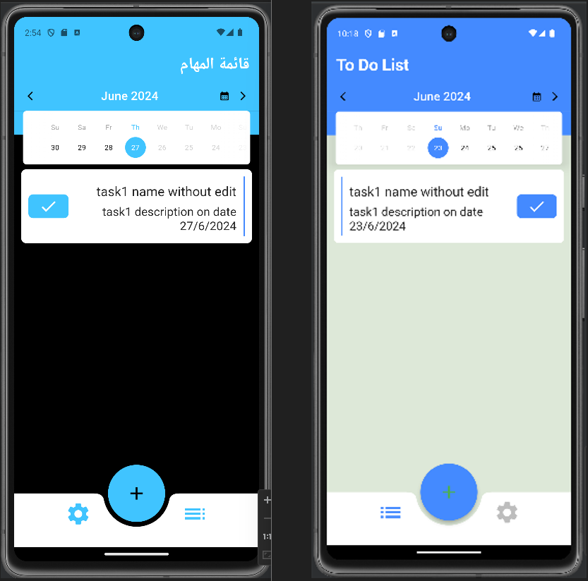
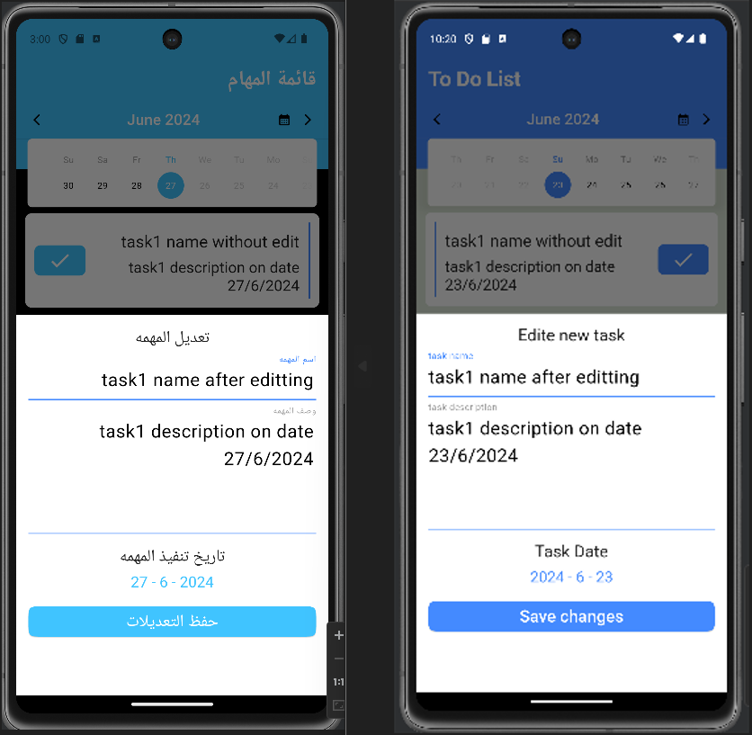
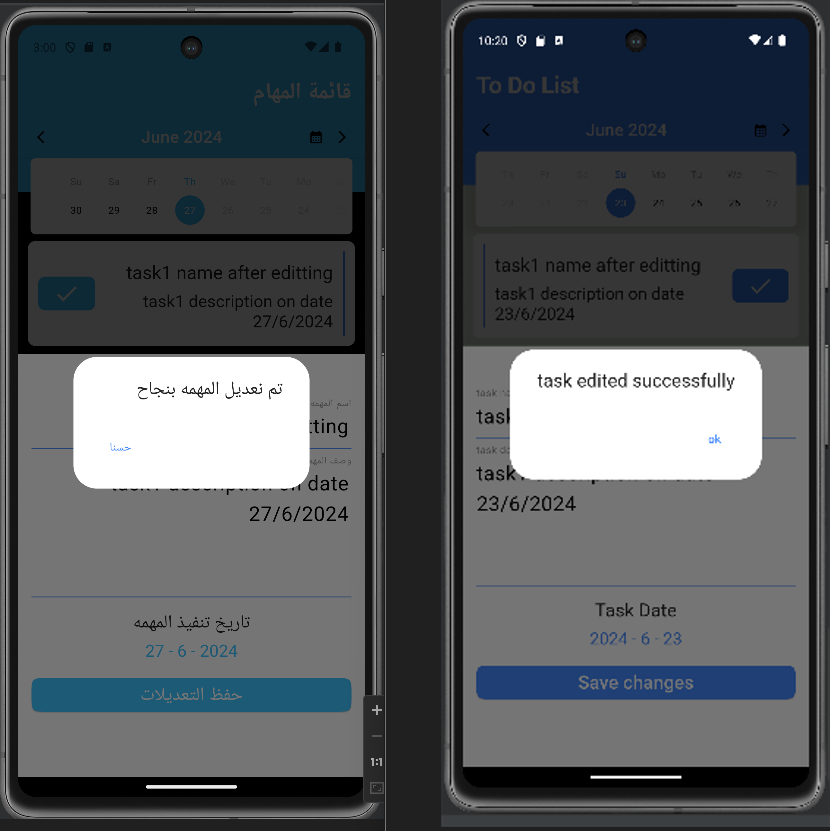
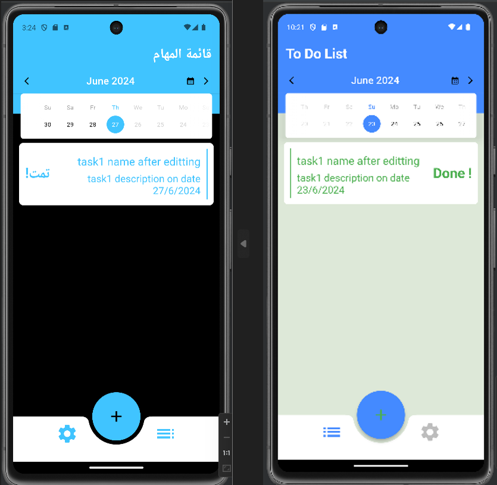
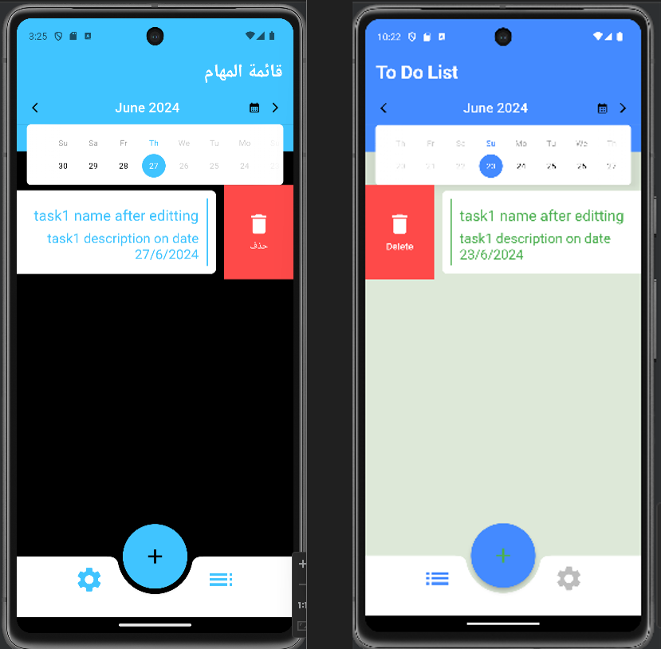
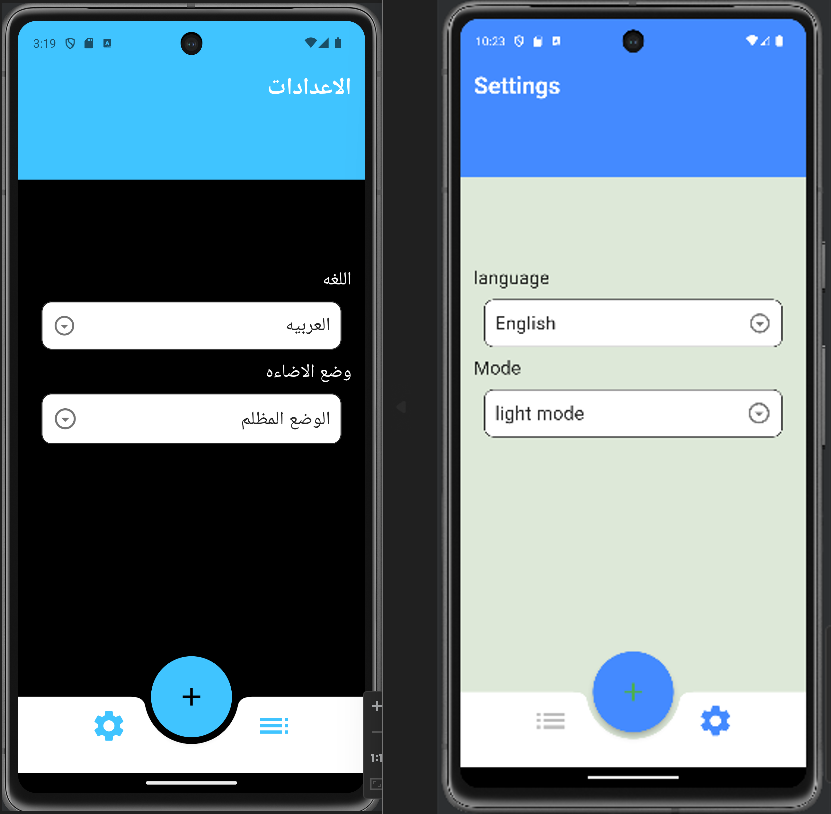

# To-Do List Mobile App - README

## Overview

Welcome to the To-Do List Mobile App! This app helps you organize your tasks efficiently. You can add, edit, mark as done, or delete tasks, and customize the app's appearance and language settings.

## Features

1. **Add a New Task**
    - Add a new task for a specific date.
    - The added task will be displayed under its specified date.

2. **Edit a Task**
    - Easily edit any task that you have added.

3. **Mark Task as Done**
    - Mark tasks as done to keep track of your completed tasks.

4. **Delete a Task**
    - Delete tasks that are no longer needed.

5. **Settings Tab**
    - Choose between Arabic and English language.
    - Select either Dark Theme Mode or Light Theme Mode for the app's appearance.
## Usage
1.      **Add a New Task** 
     - Enter the task name in the provided input field.
     - Enter the task details in the provided input field.
     - Select the date for the new task.
     - Press the "Add Task" button.
     - The new task will appear under the selected date.
     
     
     

2.      **Editing a Task**
     - Navigate to the task you want to edit.
     - Tap on the task to open the edit interface.
     - Make the necessary changes and save the changes using Save Changes button.
       
       
   
3.      **Marking a Task as Done**
     - Locate the task you want to mark as done.
     - Tap the checkbox or "Mark as Done" button next to the task.
       
   
4.      **Deleting a Task**
     - Find the task you wish to delete.
     - Swipe left on the task (or press the delete button) to remove it.
       
   
5.      **Settings Tab**
     - Open the settings tab from bottom navigation bar.
     - Select your preferred language (Arabic or English).
     - Choose your preferred theme mode (Dark or Light).
       
   
## Installation
1. Clone the repository:
   ```bash
   git clone https://github.com/YoussefMohamed7557/Todo_list_flutter.git
2. Navigate to the project directory:
   ```bash
   cd Todo_list_flutter
Happy tasking!